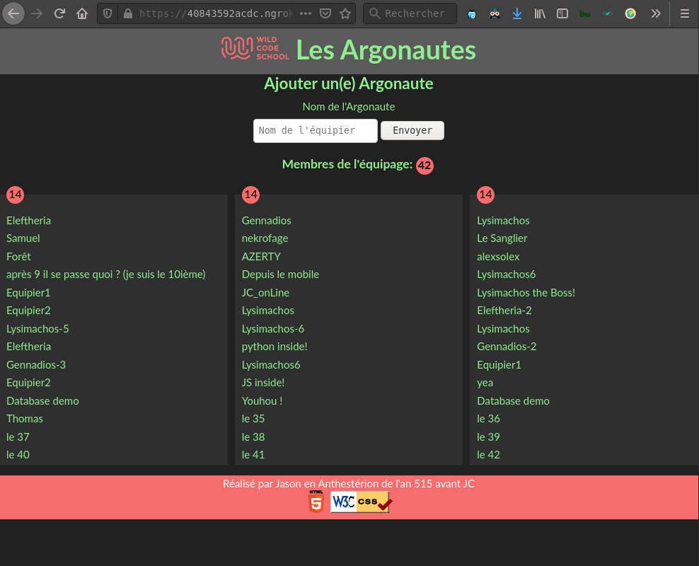
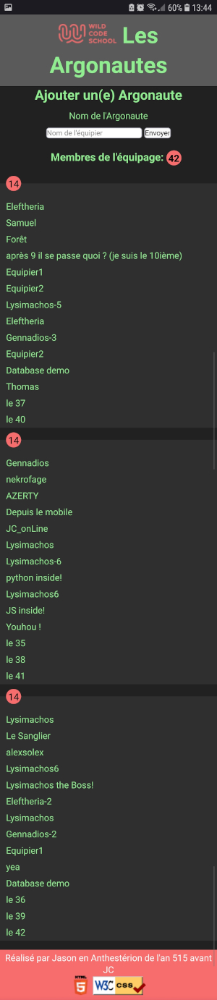
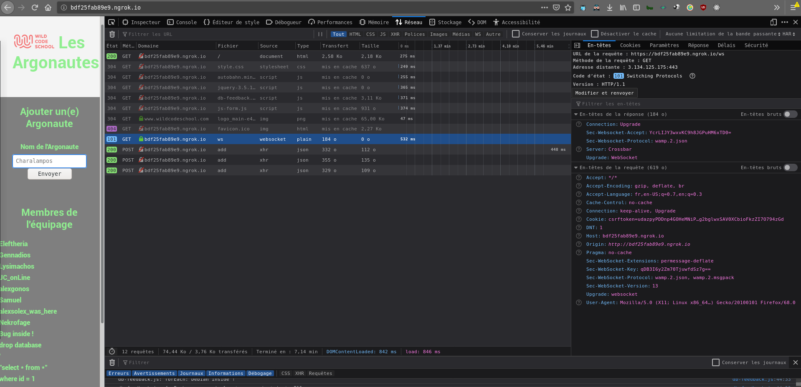
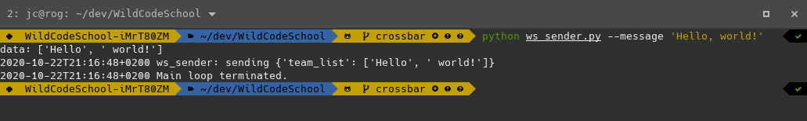
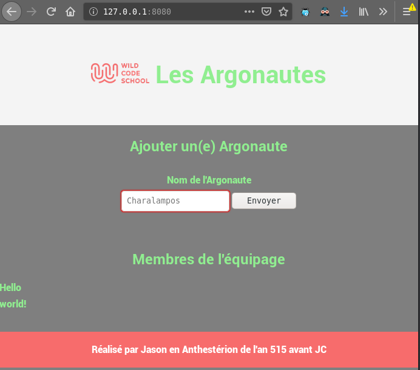

# This is a WilCodeSchool Challenge !

## The objective
WilCodeSchool asked to make an "Argonautes" list in a website.
There is a snippet code on codepen.io <https://codepen.io/wildcodeschool/pen/LYpoBBN>

We must create a database to store the particitants list.

There is only one text field in the database, and the `Envoyer` button adds a new "Argonautes" team member.

At the bottom of page, the complete participant list must be displayed in realtime in 3 columns. 
So, when we add a name, every web navigators client can see the new participant name added in realtime. 
The maximum team members is 50.
All technics are allowed.

## What technology do I choose ?
I decided to use ***Django*** a ***Python*** Web Framework coupled to ***Crossbar.io*** a `Web Application Messaging Protocol` (WAMP).
I used a classic ***JavaScript*** and ***Ajax*** features too.

### The tasks of each Framework are dispached like that:
- ***Django***: Manages the `database` and displays the first boot page.
- ***Ajax*** `form`: Sends data to ***Django***.
- ***Crossbar***: Manages a `Websocket channel` to display in realtime data to every connected clients.
- ***JavaScript***: Manages the `DOM` and displays data without refreshing the page (*Navigator F5 key*). 

## How does it run ?
To understand exactly what is happening, this is the execution sequence step by step:
1. Web client connects to [https://domain/wcs/home](https://domain/wcs/home).
2. ***Django*** displays the home page with ***Ajax*** `form` and the current database member list with the `main_page` view.
3. If the list isn't complete, the `user` enters a name member to add it and presses `Envoyer`.
4. The ***Ajax*** form sends data to [https://domain/wcs/add](https://domain/wcs/add) without reloading the page.
5. The `add_argonaute` ***Django*** view gets ***Ajax*** data and saves it in the database.
6. The ***Django*** `models.py` catches `post_save` notification event and uses ***Crossbar.io*** to send database image to the web page in `realtime`.  
7. ***JavaScript*** and ***Crossbar.io*** work in pairs thanks to the `subscribe` method. Data are received via `Websocket` connection and the `DOM` is updated for each conneted clients.
8. Users enter a new name member, the whole exchange protocol is repeating until the team is complete and `JavaScript` locks the input form.
9. It is possible to `Reset` the list: Go to [https://domain/wcs/reset_argonautes](https://domain/wcs/reset_argonautes) and back to [https://domain/wcs/home](https://domain/wcs/home) url. 

## How to install ?
- I use `Pipenv` to set up the `Python Virtual environment`.
- There is a `Pipfile` and `Pipfile.lock`.
- So run `pipenv install` to set up what the project needs.
- Note: `channels` and `channels-redis` are not used here. I made some research about realtime communication, but I think they are too complicated for this application. I prefer using `Crossbar.io`.
```
WildCodeSchool
├── django
│   ├── argonautes
│   ├── db.sqlite3
│   ├── docs
│   ├── manage.py
│   ├── Pipfile
│   ├── Pipfile.lock
│   ├── project_cfg
│   ├── __pycache__
│   ├── README.MD
│   ├── requirements.txt
│   ├── static
│   └── web
└── secure-zone
    ├── django-env.json
    └── db.sqlite3
```
- The `secure-zone` folder is used to separate `settings` and `database` from `github` and `deployment server`.
  
  `django-env.json` config example in `secure-zone`:
  ```
  {
    "DJANGO_URL": "open1024.fr",
    "DJANGO_DEBUG": "False",
    "DJANGO_KEY": "******DJANGO-SECRET-KEY******"
  }
  ```
- In a terminal, go to `django` folder and run the application:
  
  `crossbar start` 
- Start web navigator ang to localhost in `8080` port:

  `http://127.0.0.1:8080`

## What about the design ?
### The settings:
- The maximum team members (default=50) is stored in `AppliSettings` models.
- The column numbers (default=3) are stored in `AppliSettings` too.
- These values can be changed in the `Django admin` page. 
### Screen adaptation
- The `CSS` uses `CSS Gird`.
- Columns are responsive with a simple `minmax(250px, 1fr)`.
- There is only one column on smartphone display.
## Show me some screenshots !
### Desktop

### Smartphone


## Websocket Powa !
In the `Firefox console` you can see the `Websocket` network :



## Websocket in Command Line Interface !
For fun, I make a Command Line Interface (CLI) to send text to web page:
- This is the CLI emitter:



- This is the receiver:


